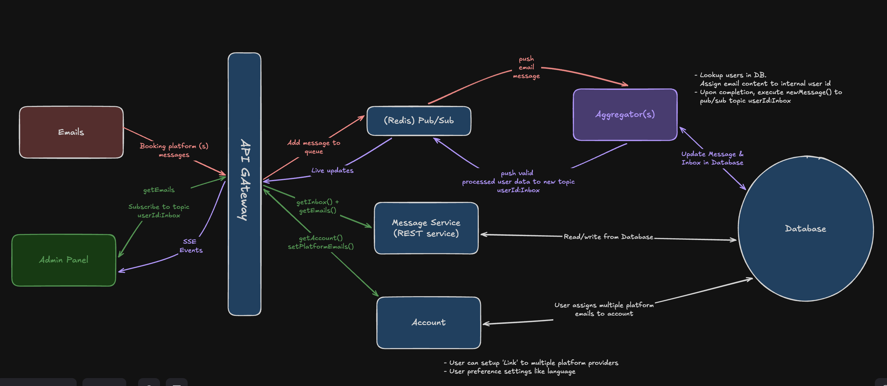

# POC Unified Inbox

Web inbox for property owners who receive messages from multiple letting platforms (for example: Foxtons, Rightmove, Zoopla, Expedia).

This is a first iteration focused on core flows and API thinking, not a polished product.

## Problem Statement

Property owners often need to monitor communication across multiple services. The goal of this project is to aggregate those messages into one inbox so owners can:

- browse all messages in one place
- quickly identify which platform sent each message
- open a message and view message content, property details, and booking details

## Scope Implemented (Iteration 1)

- Aggregated inbox view with per-item platform identity
- Message details pane
- Property/booking metadata pane
- Status updates (for example: `new` -> `viewed`)
- Delete flow with confirmation modal
- Utilises server functions for data fetching and rest interactoins, these do not take place in the client browser, helps with fast, interactive experience. 
- Realtime-ish updates via SSE for inbox events
- Data model are simple array constructs that model the resolved output of a repsonse to a DB backend.

## Out of scope
 - Security
 - Scaling backend to support frontend
 - UX features like searching/filtering/replying
 - Backend caching/durability/consistency
 - i18n

## API Design Reasoning

The aggregation service is mocked in `backend/src/model` but designed as if it fronts multiple upstream platforms.

- Keep frontend simple: one consistent API surface regardless of provider
- Normalize message/inbox structures so UI does not branch by platform
- Support incremental evolution toward real upstream adapters later

### Entities
- User
- Inbox
- Messages
- Platforms

### Endpoints (incomplete)

- `GET /api/v1/inboxes/:userId` (Get user inbox, passing id here, but should be retrived via header)
- `PATCH /api/v1/inboxes/:inboxId` (update inbox status)
- `GET /api/v1/messages` (All messages)
- `GET /api/v1/messages/:messageId` (Single message)
- `DELETE /api/v1/messages/:messageId` (Delete message)
- `GET /api/v1/events?channel=user:{userId}:inbox` (SSE stream)

I have faked an account system where a userId is passed via HTTP headers.

### One API vs multiple APIs

For this iteration, one aggregation API is used. This avoids direct frontend coupling to each letting service and gives a single contract for pagination, filtering, auth, and formatting.

### Direct calls vs BFF

Current approach is close to a lightweight BFF style in the Next.js app:

- frontend server actions and server components call backend API
- backend acts as Message service with Redis pubsub. Assumption made the aggregation has already taken place and pushed to DB 

This keeps environment secrets and service URLs on the server side where possible.

## UX/Design Notes

- Clean, utility-first UI with Tailwind + shadcn components
- Visual indicators for message state (`new`/`viewed`)
- Split-pane admin layout for inbox + details
- Confirmation modal for destructive actions

No final design system spec was provided, so styling decisions prioritize clarity, consistency, and fast iteration.

## Project Structure

```text
simple-mail-aggregator/
├── backend/      # Mock Message service (Express + TypeScript)
├── frontend/     # Next.js app (App Router)
└── docker-compose.yml
```

## Running the Project

### Requirements

Make sure the following are installed on your machine:

- **Docker Desktop** (required for Redis and backend dependencies via `docker-compose`)
- **Node.js** (recommend LTS, e.g. `>=20`)
- **pnpm** (recommened package manager used by both frontend and backend)
-- `npm install -g pnpm`
### Backend

```bash
cd backend
pnpm install
docker-compose up 
```

### Frontend

```bash
cd frontend
pnpm install
pnpm dev
```
Go to http://localhost:5010/admin/123
```bash
1. In Navbar click on 'User One'
2. It will connect to the backend, and open a connection for live updates via SSE
3. Click on inbox messages 
4. Delete Message
5. Real-time message updates (below) 
```

### Redis Pubsub to test real-time updates.
```bash
1. http://localhost:5049
2. Pop-up appears, toggle 'I have read and understood the Terms' -> Submit
3. Click +Add Redis Database
4. Click 'Connection Settings'
5. Host=redis Password=secret -> Add database
6. Click on 127.0.0.1:6379, on side panel click 'Pub/sub'
7. 'Enter channel name' = user:123
8. Paste the json below into the message. This will propogate to the frontend.
```
#### Test SSE Payload
```json
[
   {
      "id":"1",
      "platform":{
         "id":"1"
      },
      "subject": "Upcoming home inspection",
      "message":"Upcoming home inspection, please be available at 13:00 Monday 28th.",
      "createdAt":"2026-02-08T00:00:00.000Z",
      "updatedAt":null,
      "messageMetadata":{
         "source":"email@foxtons.com",
         "type":"Yahoo"
      },
      "bookingDetails":{
         "id":"7",
         "date":"2026-02-08T00:00:00.000Z",
         "status":"confirmed",
         "propertyDetails":{
            "id":"191",
            "propertyAddress":"123 Main St, London, UK",
            "propertyType":"Flat"
         }
      }
   }
]
```


## Next Iteration Ideas on UI

- Better optimistic update + rollback contracts for server actions (Speedy client experience)
- More focus on UX & User state in the client, to allow richer experience
  with settings preference, i18n, and more.
- Unified SSE event typing (`created` / `updated` / `deleted`). This is a one way street, but if live comms is needed, 
  websockets would be better suited.
- Filtering, search, pagination, and richer platform badges/icons
- Connect to a DB (postgres) to allow for better data management that scales well. Read optimised. 
- Alot more! Requires more discussion! See system design below on overview of services.

## Proposed system design of all interacting services 


## Testing architecture
- Use Storybook to isolate components for stakeholder approval. Act as a reusable component library.
- Use test engine like Jest to unit test components.
- Backend API testing with a pact server (API contract testing).
- All code pushed to upstream CI pipeline (Github workflows/Atlasian Stash).
  - PR branch builds ephermeral environments where tests run and act as a demo Env.
- Profile rendering and monitor performance metric thresholds (via React <Profiler> )
